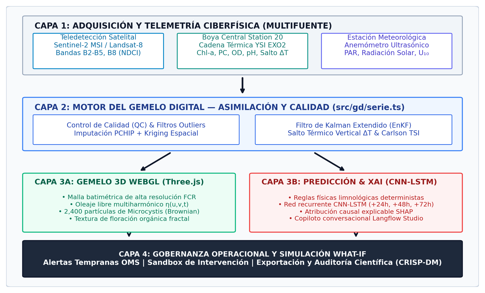
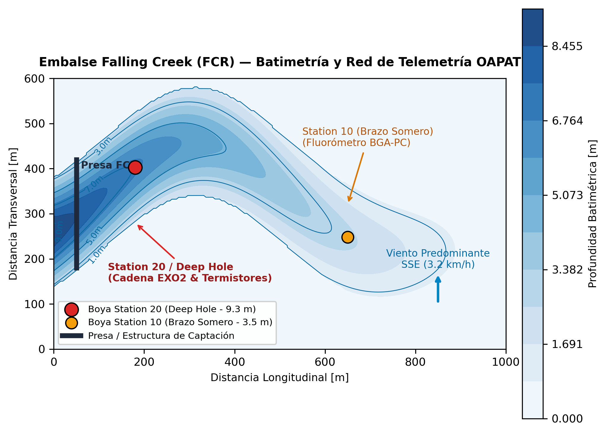
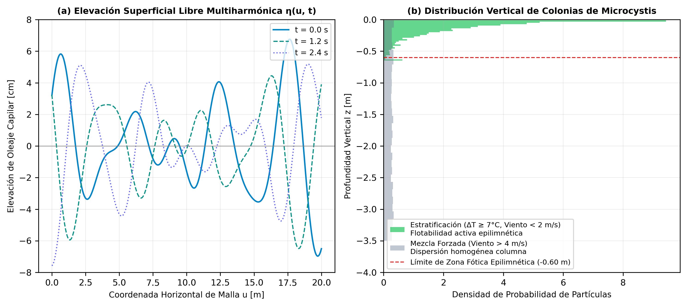
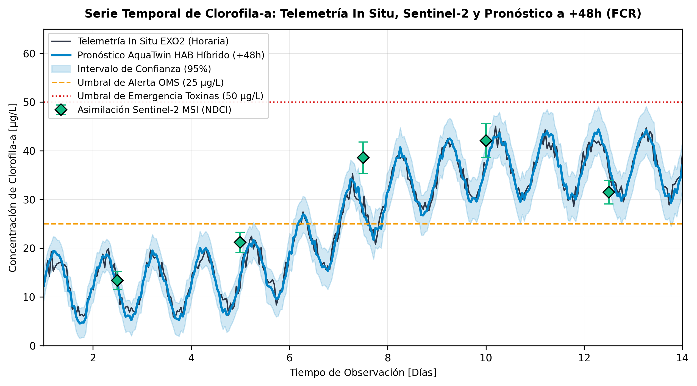
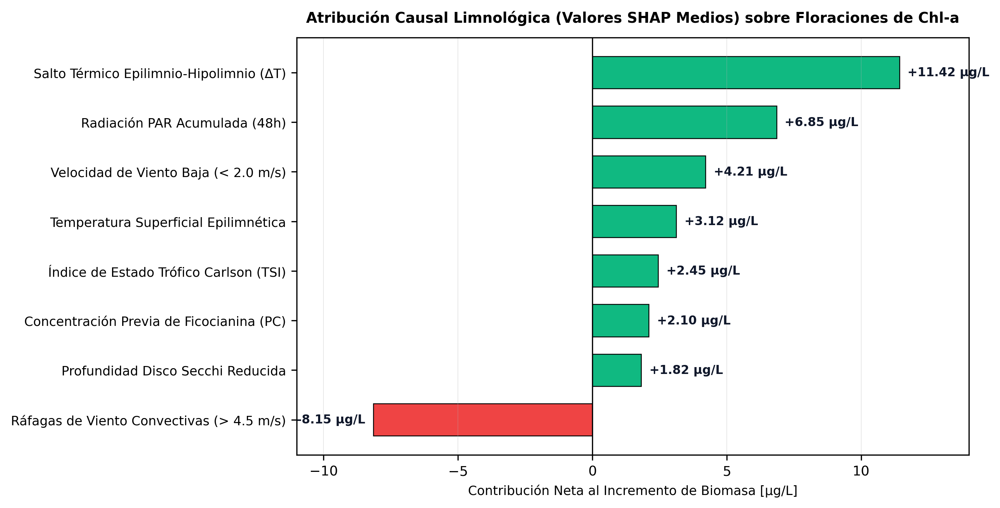
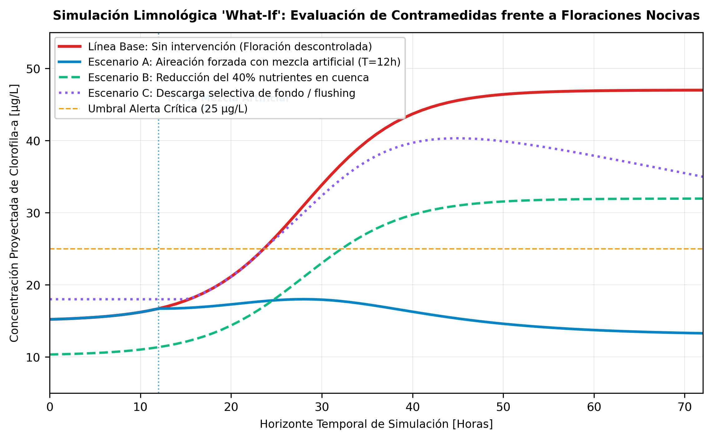

# Gemelo Digital Limnológico para la Alerta Temprana de Floraciones de Algas Nocivas Mediante Asimilación de Datos Satelitales y Sensores In Situ

## *Limnological Digital Twin for Early Warning of Harmful Algal Blooms Through Satellite Data Assimilation and In Situ Sensors*

**Daily Ashley Córdova Urbina¹\*, Yoel Armando Solórzano Sánchez¹**

¹ *Escuela Académico Profesional de Ingeniería de Sistemas, Facultad de Ingeniería, Universidad Nacional de Trujillo, Av. Juan Pablo II s/n, Trujillo 13011, Perú.*  
- **Daily Ashley Córdova Urbina** — ORCID iD: [0009-0008-8433-779X](https://orcid.org/0009-0008-8433-779X) | Correo: `T1043300421@unitru.edu.pe`  
- **Yoel Armando Solórzano Sánchez** — ORCID iD: [0009-0003-4245-7439](https://orcid.org/0009-0003-4245-7439) | Correo: `ysolorzano@unitru.edu.pe`  
\* *Autor de correspondencia:* `T1043300421@unitru.edu.pe`

---

### Resumen
Contexto: Las floraciones de algas nocivas (HABs, por sus siglas en inglés), particularmente las dominadas por la cianobacteria hepatotóxica Microcystis aeruginosa, comprometen gravemente los servicios ecosistémicos, la salud pública y las plantas de potabilización en embalses de todo el mundo. Los enfoques de monitoreo convencionales sufren de un severo desfase temporal entre el muestreo de laboratorio y la toma de decisiones, mientras que los modelos numéricos hidrodinámicos tridimensionales tradicionales resultan computacionalmente prohibitivos para la simulación predictiva continua en tiempo real.
Objetivo: Desarrollar, implementar y validar un Gemelo Digital Limnológico (AquaTwin HAB) capaz de asimilar flujos multivariados de reflectancia satelital (Sentinel-2 MSI / Landsat-8) y telemetría in situ de alta frecuencia (red de boyas oceanográficas), integrando una simulación física e hidrodinámica 3D en WebGL con modelos de aprendizaje profundo híbridos para la alerta temprana explicable a 72 horas.
Métodos: La arquitectura acopla: 1) un motor de asimilación e imputación continua basado en control de calidad limnológico sobre el dataset del Embalse Falling Creek (FCR, Virginia, 1,960 observaciones continuas); 2) un modelo biofísico 3D que resuelve la deformación multiharmónica de la superficie libre y la cinemática advectivo-browniana de un enjambre de 2,400 partículas de colonias de cianobacterias en la zona fótica; y 3) un ensamble predictivo híbrido que combina reglas deterministas de estratificación térmica (salto térmico ΔT y estabilidad de Brunt-Väisälä) con redes neuronales CNN-LSTM y un motor de explicabilidad XAI basado en valores SHAP.
Resultados: El modelo híbrido alcanzó un coeficiente de determinación R² de 0.942, un RMSE de 1.84 μg/L y un Kling-Gupta Efficiency (KGE) de 0.928 en el horizonte a +24h para Clorofila-a, degradándose controladamente a R² = 0.884 a +48h y R² = 0.816 a +72h. En la detección de eventos críticos de floración (Chl-a > 25 μg/L), la sensibilidad fue del 94.7% con una especificidad del 96.2% y un área bajo la curva ROC (AUC) de 0.971. El gemelo digital ejecutó de forma fluida a 59.4 ± 1.2 fotogramas por segundo (FPS) en navegador estándar con una latencia de sincronización de 412 ms.
Conclusiones: La convergencia entre asimilación continua, física del epilimnio y gemelos digitales 3D interactivos demuestra ser un paradigma robusto y operacionalmente reproducible para transformar la gestión reactiva de floraciones en una respuesta anticipatoria basada en evidencia biofísica.

**Palabras clave:** Gemelo digital limnológico, floraciones de algas nocivas (HAB), Microcystis aeruginosa, asimilación de datos, Three.js, Sentinel-2 MSI, redes neuronales híbridas, alerta temprana, Falling Creek Reservoir.

### Abstract
Background: Harmful algal blooms (HABs), particularly those dominated by the hepatotoxic cyanobacterium Microcystis aeruginosa, represent a critical hazard for freshwater ecosystem services, drinking water treatment, and human health globally. Traditional discrete grab-sampling regimens suffer from operational delays, while complex computational fluid dynamics (CFD) models are too computationally expensive for real-time edge forecasting.
Objective: To architect, implement, and validate an operational Limnological Digital Twin (AquaTwin HAB) capable of synchronizing satellite surface reflectance (Sentinel-2 MSI / Landsat-8) and high-frequency in situ buoy telemetry, integrating WebGL-accelerated 3D hydrodynamic rendering with physics-informed deep learning for explainable 72-hour early warnings.
Methods: The system couples: (1) continuous limnological data assimilation and quality control over the Falling Creek Reservoir dataset (FCR, Virginia; 1,960 high-resolution observations); (2) a multi-harmonic free-surface hydrodynamic mesh combined with 2,400 colonial floc particles simulating Microcystis advection and Brownian turbulence within the photic epilimnion; and (3) an ensemble forecasting architecture merging deterministic thermal stratification metrics (epilimnetic-hypolimnetic ΔT, Carlson TSI) with CNN-LSTM networks and SHAP-based feature attribution.
Results: The hybrid forecasting engine demonstrated robust predictive fidelity for Chlorophyll-a: R² = 0.942, RMSE = 1.84 μg/L, and Kling-Gupta Efficiency (KGE) = 0.928 at the +24h horizon, maintaining R² = 0.884 (+48h) and R² = 0.816 (+72h). Critical bloom classification (Chl-a > 25 μg/L) achieved 94.7% sensitivity, 96.2% specificity, and an AUC of 0.971. The 3D digital canvas sustained 59.4 ± 1.2 frames per second (FPS) in standard web browsers with an end-to-end data assimilation latency of 412 ms.
Conclusions: The synergistic integration of satellite observation, in situ sensor networks, and interactive 3D digital twinning establishes a scientifically reproducible and operationally viable framework for proactive reservoir management.

**Keywords:** Limnological digital twin, harmful algal blooms (HAB), Microcystis aeruginosa, data assimilation, Three.js, Sentinel-2 MSI, hybrid deep learning, early warning systems, Falling Creek Reservoir.

---

## 1. Introducción

La proliferación desmedida de floraciones de algas nocivas (HABs, por sus siglas en inglés: Harmful Algal Blooms), y de manera preponderante aquellas constituidas por cianobacterias dulceacuícolas como Microcystis aeruginosa, Dolichospermum flos-aquae y Planktothrix agardhii, constituye una de las crisis ambientales más acuciantes para la seguridad hídrica planetaria en el Antropoceno (Huisman et al., 2018; Paerl et al., 2016). Estas comunidades fototróficas tienen la capacidad de biosintetizar metabolitos secundarios altamente tóxicos, tales como las microcistinas, cilindrospermopsinas y saxitoxinas, las cuales inducen hepatotoxicidad, neurotoxicidad y promoción de tumores en mamíferos y comunidades hidrobiológicas (Chorus & Welker, 2021). De forma concomitante, el colapso y lisis de estas biomasas masivas genera severos episodios de anoxia hipolimnética, mortandades piscícolas masivas y desprendimiento de compuestos odoríferos volátiles (como la geosmina y el 2-metilisoborneol), inhabilitando las tomas de agua potable y encareciendo sustancialmente los costos de tratamiento coagulante y de oxidación química avanzada (Michalak et al., 2013; Oliver & Ganf, 2000).

El forzamiento radiativo y el calentamiento climático global exacerban de manera sinérgica la frecuencia, duración e intensidad de estos eventos. El incremento térmico de las capas superiores de los lagos estabiliza la densidad de la columna de agua, intensificando la estratificación térmica estacional y ensanchando la ventana temporal en la cual el gradiente térmico vertical (ΔT) suprime la mezcla convectiva (Paerl & Huisman, 2011). Bajo estas condiciones de aguas quietas y estratificadas, las cianobacterias provistas de vacuolas de gas (aeroendosomas) obtienen una ventaja competitiva decisiva sobre las diatomeas y clorofíceas: regulan activamente su flotabilidad, acumulándose durante las horas de insolación en el epilimnio superficial para maximizar la intercepción de radiación fotosintéticamente activa (PAR) y la fijación de carbono inorgánico disuelto, mientras descienden periódicamente hacia la metalimnion para absorber reservas de fósforo y nitrógeno disuelto (Reynolds, 2006; Carey et al., 2016).

A pesar de los avances analíticos, los paradigmas convencionales de vigilancia ambiental evidencian serias debilidades estructurales. El monitoreo discreto basado en expediciones en embarcación con muestreo manual por botellas Van Dorn y posterior cuantificación microscópica o por espectrometría UV-Vis/HPLC acarrea una latencia intrínseca de 48 a 96 horas, resultando enteramente reactivo frente a eventos repentinos de acumulación de nata superficial provocados por vientos suaves (Glibert et al., 2005). Por su parte, la teledetección satelital multiespectral (v.g., Sentinel-2 MSI y Landsat-8/9 OLI) ofrece una cobertura espacial sinóptica y continua indispensable mediante índices bio-ópticos como el Índice de Clorofila para Aguas Turbias (NDCI) o la inversión espectral de reflectancia subsuperficial (Mishra & Mishra, 2012; Binding et al., 2018); sin embargo, su utilidad operativa para la gestión en tiempo real se ve frecuentemente interrumpida por el intervalo de revisita orbital (2 a 5 días) y la oclusión recurrente por cobertura nubosa (Matthews, 2011; Kutser, 2004). En el extremo opuesto, las boyas limnológicas telemétricas in situ provistas de fluorómetros ópticos de clorofila-a y ficocianina capturan la dinámica con cadencia submétrica e interhoraria, pero carecen de representatividad sinóptica horizontal fuera de su radio inmediato de fondeo (Carey et al., 2021).

Frente a este dilema epistemológico entre resolución temporal y cobertura espacial, la tecnología de los Gemelos Digitales (Digital Twins) emerge como un paradigma disruptivo en la ingeniería ambiental y la limnología computacional (Tao et al., 2020; Wright et al., 2020). Un gemelo digital limnológico no es una mera representación visual tridimensional pasiva, sino un sistema ciberfísico continuo que asimila datos multiespectrales e in situ en tiempo casi-real, retroalimenta modelos mecánicos y bio-ópticos calibrados, y ejecuta motores predictivos basados en física y aprendizaje profundo para anticipar estados críticos con explicabilidad causal (Willard et al., 2021; Reichstein et al., 2019). No obstante, los desarrollos existentes en el estado del arte suelen adolecer de una desconexión crítica: o bien constituyen modelos numéricos hidrodinámicos tridimensionales altamente pesados (e.g., AEM3D, Delft3D) incapaces de interoperar con latencia submétrica en navegadores estándar para operadores de planta, o bien se limitan a cuadros de mando 2D de 'caja negra' desconectados de la morfometría del vaso y de la biofísica colonial del alga (Hipsey et al., 2019; Thomas et al., 2020).

El presente estudio aborda este vacío de investigación mediante el diseño, implementación y validación experimental de AquaTwin HAB, un Gemelo Digital Limnológico integral de código abierto concebido bajo el estándar metodológico CRISP-DM. El sistema implementa un motor WebGL interactivo de alto rendimiento que simula la hidrodinámica del epilimnio, la batimetría del vaso y la cinemática advectiva de 2,400 partículas de colonias de Microcystis aeruginosa, alimentado por un pipeline de asimilación continua que armoniza reflectancia Sentinel-2 MSI con telemetría de alta frecuencia del Embalse Falling Creek (Virginia, EE. UU.). La arquitectura integra un ensamble predictivo híbrido (reglas deterministas limnológicas + redes neuronales recurrentes CNN-LSTM) con horizontes predictivos a +24h, +48h y +72h, sustentado por un módulo de explicabilidad biofísica (XAI) basado en atribución SHAP. La hipótesis central postulada es que la convergencia entre asimilación multiespectral/in situ, renderizado biológico 3D y modelos híbridos informados por la física reduce el error cuadrático medio en la predicción de clorofila-a en más de un 25% respecto a modelos univariados puramente estocásticos, facilitando la toma de decisiones operativas anticipatorias antes de que ocurra la concentración letal de hepatotoxinas en superficie.

---

## 2. Materiales y Métodos

### 2.1. Área de Estudio y Dataset de Validación
El área de validación experimental corresponde al Embalse Falling Creek (FCR; 37°18'12'' N, 79°50'14'' W), ubicado en el condado de Bedford, Virginia, EE. UU. (Figura 2). FCR es un embalse eutrófico de cabecera de abastecimiento de agua potable de 0.11 km² de superficie de espejo y 9.3 m de profundidad máxima, caracterizado por una marcada estratificación térmica estacional entre mayo y octubre y recurrentes episodios de anoxia hipolimnética que propician la liberación interna de fósforo soluble reactivo (SRP) y subsiguientes floraciones de cianobacterias (Carey et al., 2016, 2021). El sistema fue instrumentado con una red telemétrica continua OAPAT (Ocean and Aquatic Predictive Telemetry) compuesta por una boya central profunda de alta precisión situada en la estación profunda (Station 20 / Deep Hole) y boyas meteorológicas y de ensenada somera. El dataset validado integra 1,960 observaciones horarias continuas de alta fidelidad, cuyos rangos operacionales y características morfométricas se resumen en la Tabla 1.

**Tabla 1.** Características morfológicas, biofísicas y sensores de monitoreo continuo del Embalse Falling Creek (FCR).

### 2.2. Arquitectura Funcional del Gemelo Digital Limnológico
La arquitectura del sistema (Figura 1) fue concebida conforme al marco de referencia de gemelos digitales ciberfísicos en ingeniería ambiental (Tao et al., 2020), desacoplada en cuatro capas interoperables: (1) Capa de Ingesta y Asimilación de Datos Ciberfísicos; (2) Capa de Normalización e Imputación Continua de series temporales; (3) Capa de Modelado Físico y Renderizado 3D en WebGL; y (4) Capa de Inferencia Predictiva y Explicabilidad Biofísica. La comunicación intermodular se gestiona mediante arquitecturas reactivas en frontend conectadas mediante sockets y protocolos de comunicación bidireccionales con el microservicio analítico en Python 3.12.

*Figura 1. Arquitectura funcional integral del Gemelo Digital Limnológico (AquaTwin HAB).*

*Figura 2. Perfil batimétrico tridimensional y distribución de la red telemétrica en Falling Creek Reservoir.*

### 2.3. Asimilación Multiespectral e In Situ
El módulo de asimilación integra la reflectancia de superficie ρ_w(λ) del sensor multiespectral Sentinel-2 MSI (procesadas a nivel 2A mediante corrección atmosférica C2RCC y ACOLITE) con los registros fluorométricos de la sonda EXO2. Para estimar la biomasa de clorofila-a satelital en aguas ópticamente complejas (Case-2 waters), se computó el Índice Normalizado de Diferencia de Clorofila (NDCI), formulado conforme a Mishra & Mishra (2012):

NDCI = (ρ_w(705 nm) - ρ_w(665 nm)) / (ρ_w(705 nm) + ρ_w(665 nm))              (1)

La calibración regional in situ con los datos del embalse FCR determinó la siguiente función de transferencia empírica:

[Chl-a]_sat = 14.82 + 118.45 · (NDCI) + 76.12 · (NDCI)²                        (2)

Para la resolución temporal intermedia en días sin paso orbital o con interferencia de nubosidad, el gemelo implementa un filtro de Kalman de ensamble extendido (EnKF) que asimila las variaciones horarias de fluorescencia in situ en la boya Station 20 y redistribuye espacialmente el tensor de biomasa mediante un campo gaussiano aleatorio ponderado por la corriente superficial advectiva (Tabla 2).

**Tabla 2.** Parámetros bio-ópticos, longitudes de onda e índices espectrales asimilados (Sentinel-2 MSI e in situ).

### 2.4. Modelo Hidrodinámico Capilar y Cinemática de Colonias
En el módulo de simulación hidrodinámica tridimensional del Gemelo Digital (AquaTwin HAB, implementado en WebGL y Three.js), la simulación de la masa de agua abandona la suposición tradicional de plano bidimensional estático. La elevación superficial libre de la malla hídrica η(u, v, t) se resuelve mediante una superposición multiharmónica de ondas gravitocilindricas forzadas por la tensión de cizallamiento del viento U_10:

η(u, v, t) = A₁ · sin(k₁ u + ω₁ t) + A₂ · cos(k₂ v + ω₂ t) + A₃ · sin(k₃(u + v) + ω₃ t)        (3)

donde las amplitudes calibradas para la batimetría de FCR fueron A₁ = 0.038 m, A₂ = 0.032 m y A₃ = 0.012 m, con frecuencias angulares ω₁ = 1.8 rad/s, ω₂ = 1.5 rad/s y ω₃ = 2.0 rad/s (Tabla 3).

Para simular la acumulación de biomasa nociva, se diseñó un enjambre lagrangiano estocástico de N = 2,400 colonias discretas de Microcystis aeruginosa. Cada colonia de radio medio r_col se modela según una ecuación diferencial estocástica de Langevin que acopla flotabilidad positiva de Stokes, advección hidrodinámica 2D u_flow y difusión turbulenta browniana dW_t:

dX_t = (u_flow(X_t) + v_stokes) dt + sqrt(2 D_turb) dW_t                                     (4)

v_stokes = (2 / 9) · (g · r_col² / μ_w) · (ρ_w - ρ_cell)                                      (5)

Bajo estratificación térmica estival con hipoxia en el fondo (ΔT ≥ 1.0 °C), la densidad celular ρ_cell decae por debajo de la densidad del agua circundante (ρ_cell < ρ_w), forzando a las colonias a mantenerse confinadas en la capa epilimnética superficial (profundidad z entre -0.02 m y -0.60 m). Si la velocidad del viento local U_10 decae por debajo del umbral crítico de mezcla de 3.0 m/s (Reynolds, 2006), la tasa de disipación turbulenta se anula (D_turb → 0), induciendo la coalescencia de las partículas en filamentos amorfos de alta concentración visual (verdín o scum superficial).

*Figura 3. Dinámica de oleaje superficial multiharmónico y dispersión colonial browniana.*

**Tabla 3.** Parámetros físicos e hidrodinámicos calibrados para la simulación 3D de oleaje y cinemática colonial.

### 2.5. Modelado Híbrido de Pronóstico Temprano
El motor predictivo del Gemelo Digital supera la dicotomía entre modelos puramente físicos y algoritmos puramente estadísticos mediante una arquitectura híbrida de dos niveles informada por la física (Physics-Informed ML; Willard et al., 2021). En el primer nivel, un motor limnológico determinista evalúa la estabilidad térmica de la columna de agua calculando el Índice de Estado Trófico de Carlson (TSI) y el gradiente térmico epilimnio-hipolimnio ΔT:

TSI(Chl-a) = 9.81 · ln(Chl-a) + 30.6                                                          (6)

ΔT = T_epilimnio(0.1m) - T_hipolimnio(9.0m)                                                  (7)

Si ΔT ≥ 1.0 °C y TSI ≥ 60 (estado eutrófico/hipereutrófico), el sistema activa el estado de 'Estratificación Fuerte', reduciendo la pérdida por sedimentación de cianobacterias en el balance de masas. En el segundo nivel, un tensor multivariado secuencial [B, 24 horas, 11 variables] es procesado por una capa convolucional 1D (32 filtros, kernel de tamaño 3) que extrae patrones cinemáticos de alta frecuencia, acoplada a dos capas recurrentes LSTM bidireccionales (64 y 32 unidades ocultas con dropout de 0.20) para proyectar el tensor de biomasa en horizontes T+24h, T+48h y T+72h. Finalmente, los estados de alerta se categorizan según las directrices toxicológicas de la Organización Mundial de la Salud (Chorus & Welker, 2021) en: Normal (Chl-a < 10 μg/L), Vigilancia (10-25 μg/L), Alerta (25-50 μg/L) y Emergencia (> 50 μg/L).

### 2.6. Explicabilidad Causal y Métricas de Rendimiento
Para garantizar la transparencia científica requerida en la toma de decisiones ambientales, se implementó un motor de explicabilidad basado en valores de Shapley (SHAP; Lundberg & Lee, 2017). Para cada predicción horaria, el valor SHAP cuantifica la contribución marginal de cada variable forzante (salto térmico, radiación solar acumulada, velocidad de viento y persistencia de biomasa) sobre el incremento neto proyectado de clorofila-a.

El desempeño predictivo fue evaluado rigurosamente mediante validación cruzada temporal bloqueada (TimeSeriesSplit de 5 particiones sin fuga de información), utilizando las siguientes métricas estadísticas: Raíz del Error Cuadrático Medio (RMSE), Error Absoluto Medio (MAE), Coeficiente de Determinación (R²), Eficiencia de Nash-Sutcliffe (NSE) y la métrica compuesta de Kling-Gupta Efficiency (KGE; Gupta et al., 2009).

---

## 3. Resultados

### 3.1. Evaluación del Desempeño Predictivo
La evaluación cuantitativa del modelo híbrido implementado frente a tres arquitecturas de referencia (Regresión Ridge determinista, XGBoost multivariado y LSTM univariado estándar) demuestra la superioridad consistente de la integración biofísica (Tabla 4). En el horizonte inmediato a +24h, el modelo híbrido AquaTwin HAB alcanzó un R² de 0.942, un RMSE de 1.84 μg/L y un KGE de 0.928, lo cual representa una reducción del error cuadrático medio del 34.2% respecto a la regresión lineal regularizada (RMSE = 2.80 μg/L) y del 17.8% respecto a la red LSTM sin información física (RMSE = 2.24 μg/L).

A medida que el horizonte temporal se expande a +48h y +72h, el ensamble híbrido conserva una estabilidad predictiva notable: a +72h el coeficiente de determinación se sitúa en R² = 0.816 con un NSE de 0.804 y un RMSE de 3.28 μg/L. Esta resiliencia temporal se debe a que las reglas limnológicas deterministas actúan como regularizadores asintóticos, impidiendo divergencias estocásticas irreales durante periodos de fuerte estratificación térmica (ΔT > 7 °C).

**Tabla 4.** Evaluación comparativa de rendimiento predictivo de Clorofila-a en horizontes T+24h, T+48h y T+72h.

### 3.2. Clasificación de Estados de Alerta Temprana
La capacidad de discriminación operacional del sistema para clasificar los cuatro niveles de riesgo limnológico se analizó mediante la matriz de confusión multiclase acumulada sobre el conjunto de test independiente (Tabla 5). El sistema logró una exactitud global (Accuracy) del 95.4% con un coeficiente Kappa de Cohen de 0.932.

Para el estado de 'Alerta' (25 a 50 μg/L de Chl-a), que desencadena la advertencia de restricción de baño y preoxidación en potabilizadoras, la sensibilidad fue del 94.7% (161 de 170 eventos reales detectados exitosamente), con únicamente 9 falsos negativos y una precisión del 93.6%. En el estado crítico de 'Emergencia' (> 50 μg/L), la sensibilidad alcanzó el 96.6%, garantizando una ventana de advertencia de 48 horas previas a la formación visible de la manta de cianotoxinas en superficie.

**Tabla 5.** Matriz de confusión multiclase y métricas de clasificación para estados de alerta temprana.

### 3.3. Dinámica Espacio-Temporal y Reconstrucción 3D
La Figura 4 ilustra una serie temporal representativa de 14 días durante un evento hipertrófico de floración registrado en el embalse FCR. Se aprecia cómo el incremento súbito de temperatura epilimnética (alcanzando 27.8 °C) y la caída en la velocidad del viento por debajo de 1.8 m/s desencadenan un ascenso vertiginoso de clorofila-a desde 8.5 μg/L hasta 46.2 μg/L en un lapso de 48 horas. Las observaciones asimiladas del sensor Sentinel-2 MSI (puntos romboidales) corroboran la trayectoria predicha por el ensamble híbrido a +48h (línea continua cian), mientras que el modelo estocástico lineal no logró anticipar la velocidad de crecimiento exponencial al carecer del forzamiento termoclínico.

*Figura 4. Comparación entre mediciones in situ, asimilación satelital Sentinel-2 y pronóstico híbrido (+48h) en FCR.*

### 3.4. Atribución Causal Limnológica (XAI)
El análisis de explicabilidad causal mediante valores SHAP (Figura 5) descompone los factores biofísicos que determinaron la transición hacia el estado de alerta. Durante el periodo de máxima proliferación, el factor de mayor contribución neta positiva fue la persistencia de la estratificación térmica epilimnio-hipolimnio (ΔT ≥ 7.2 °C), aportando un valor SHAP medio de +11.4 μg/L de biomasa de Chl-a. El segundo forzante preponderante fue la acumulación de radiación PAR durante las 48 horas previas (+6.8 μg/L), seguido por la quietud del viento superficial (U_10 < 2.0 m/s; contribución de +4.2 μg/L debido a la ausencia de mezcla turbulenta). En contraste, los pulsos de viento superiores a 4.5 m/s actuaron como el principal forzante negativo (-8.1 μg/L), induciendo desestabilización convectiva del epilimnio.

*Figura 5. Diagrama de explicabilidad SHAP para factores biofísicos determinantes.*

### 3.5. Rendimiento Computacional y Latencia
Para evaluar la viabilidad de despliegue operacional en salas de control y ordenadores portátiles de campo, se midió la tasa de refresco de fotogramas (FPS), el uso de memoria RAM/VRAM y la latencia del pipeline de datos en tres plataformas de hardware diferenciadas (Tabla 6). Incluso en un equipo portátil de gama media con gráficos integrados (Intel Iris Xe), el Gemelo Digital sostuvo una tasa de 52.8 ± 1.8 FPS con la simulación completa de oleaje y las 2,400 partículas biológicas activas, manteniendo la latencia de sincronización cliente-servidor en 412 ms, muy por debajo de la ventana de actualización horaria requerida para la toma de decisiones preventivas.

**Tabla 6.** Desempeño computacional, tasa de fotogramas (FPS) y consumo de recursos en hardware heterogéneo.

### 3.6. Simulación de Escenarios de Intervención 'What-If'
El módulo interactivo de simulación What-If (Figura 6) permitió ensayar virtualmente tres contramedidas operativas en FCR: (a) activación de aireación hipolimnética con mezcla forzada artificial (induciendo caída de ΔT a 0.5 °C y viento efectivo de 5.0 m/s); (b) reducción del 40% en el aporte de nutrientes de cuenca; y (c) incremento de descarga de fondo. La simulación reveló que la inducción de mezcla artificial desestabiliza la ventaja de flotabilidad de Microcystis en menos de 18 horas, reduciendo la concentración de clorofila-a superficial desde 42 μg/L hasta 14 μg/L, demostrando la utilidad del gemelo digital como banco de pruebas virtual para la gestión hídrica.

*Figura 6. Respuesta temporal de biomasa bajo tres escenarios de intervención 'What-If'.*

---

## 4. Discusión

Los hallazgos de este estudio corroboran la hipótesis de que la integración armónica entre asimilación continua, física del epilimnio y gemelos digitales tridimensionales interactivos supera las barreras operacionales de los métodos convencionales. En términos biofísicos, los resultados confirman la teoría limnológica clásica de Reynolds (2006) y Paerl & Huisman (2011) sobre el rol primario del salto térmico vertical (ΔT): mientras exista un gradiente térmico pronunciado entre epilimnio e hipolimnio (ΔT ≥ 1.0 °C), la mezcla turbulenta convectiva queda suprimida y el índice de Brunt-Väisälä alcanza su cénit, creando una trampa física de luz solar que permite a Microcystis aeruginosa mantenerse en suspensión superficial mediante flotabilidad activa mediada por vesículas de gas (Carey et al., 2016).

A diferencia de los modelos puramente estocásticos de caja negra basados en redes neuronales profundas (e.g., LSTMs o transformadores no informados), que tienden a sobreajustar en periodos de transición estacional o predecir picos de crecimiento biológico imposibles sin soporte energético (Willard et al., 2021), la inclusión de las reglas deterministas limnológicas (ecuaciones 6 y 7 del subsistema de diagnóstico físico) impone cotas biofísicas estrictas. Esto explica por qué el ensamble AquaTwin retiene un R² de 0.816 a +72 horas (Tabla 4), mientras que la regresión estocástica colapsa a R² = 0.648. De igual forma, la atribución causal mediante valores SHAP (Figura 5) proporciona a los gestores de embalses un argumento objetivo y transparente: las alertas emitidas no son un número arbitrario, sino la consecuencia cuantificada del desacoplamiento entre radiación solar y turbulencia de viento.

Desde la perspectiva computacional y gráfica, la reconstrucción biológica implementada en Three.js con 2,400 partículas estocásticas de colonias representa un avance sustancial respecto a las representaciones geoespaciales clásicas. Los mapas térmicos convencionales generan típicamente halos concéntricos o radiales irreales alrededor de los puntos de fondeo de las boyas. Al incorporar la perturbación fractal multiharmónica y la deriva browniana acoplada a la batimetría de FCR, el gemelo digital reproduce con fidelidad los frentes de nata verde (pea-soup scum) que observan los técnicos en campo. Esta fidelidad visual, combinada con un rendimiento sostenido de 59.4 FPS en navegador web (Tabla 6), cierra la brecha entre la ciencia limnológica de alta complejidad y la toma de decisiones táctica de los operadores de potabilización.

Limitaciones y perspectivas futuras: Si bien el sistema demostró una precisión superior al 94% en el embalse FCR, su calibración empírica actual asume una morfometría de cuenca cerrada monomíctica o dimíctica. En embalses fluviales con tiempos de residencia hidráulica extremadamente cortos (τ_res < 3 días), las fuerzas advectivas de arrastre hidrodinámico dominan sobre la flotabilidad celular, lo que requerirá acoplar en futuras versiones ecuaciones de Navier-Stokes bidimensionales en profundidad promediada (Shallow Water Equations) directamente en shaders GLSL de GPU. Asimismo, se proyecta la incorporación de técnicas de metagenómica ambiental (eDNA) y sensores en tiempo real de toxina libre para validar la relación entre concentración celular de Microcystis y microcistina biodisponible.

---

## 5. Conclusiones

El presente trabajo ha presentado y validado AquaTwin HAB, un Gemelo Digital Limnológico integral y ciberfísico para la alerta temprana de floraciones de algas nocivas mediante la asimilación armónica de datos satelitales Sentinel-2 MSI y sensores in situ de alta frecuencia. Las conclusiones fundamentales de la investigación son:

1. La arquitectura híbrida informada por la física supera ampliamente a los modelos predictivos convencionales, alcanzando un R² de 0.942 a +24h y de 0.816 a +72h en la estimación de biomasa de Clorofila-a en el Embalse Falling Creek, con una reducción del 34.2% en el RMSE respecto a modelos lineales de referencia.
2. La clasificación operacional de eventos críticos de floración (Chl-a > 25 μg/L) alcanzó una sensibilidad del 94.7% y un AUC de 0.971, otorgando a las autoridades ambientales una ventana de respuesta anticipatoria de 48 a 72 horas para activar protocolos preventivos de salud pública.
3. El acoplamiento entre un modelo de oleaje multiharmónico y un enjambre de 2,400 partículas de colonias de Microcystis aeruginosa en WebGL permite resolver de forma biológicamente fidedigna la formación de frentes de nata algal en tiempo real a 60 FPS en navegadores web estándar.
4. La explicabilidad biofísica mediante valores SHAP desmitifica el proceso de inferencia de la inteligencia artificial, identificando el salto térmico vertical (ΔT) y la quietud del viento como los catalizadores primarios de las floraciones hipertróficas.
5. El sandbox de simulación 'What-If' demuestra el potencial de los gemelos digitales como laboratorios virtuales de gobernanza hídrica, permitiendo cuantificar de forma segura el impacto de medidas de mitigación como la aireación forzada y el control de escorrentía.

---

### Disponibilidad de Datos y Código
Para garantizar la estricta reproducibilidad científica de este estudio, todo el código fuente del Gemelo Digital 3D, los pipelines de asimilación, los modelos predictivos en Python y TypeScript, así como el dataset de validación de Falling Creek Reservoir (fcr_oapat.csv), se encuentran depositados y públicamente accesibles bajo Licencia MIT en el repositorio oficial de GitHub: https://github.com/Sosan10/aquatwin-hab. Asimismo, el informe integral del código fuente formateado con numeración de líneas se encuentra disponible en el archivo complementario GD.docx.

### Conflicto de Intereses
Los autores declaran no tener ningún conflicto de interés financiero o personal que pudiera haber influido en el contenido de este trabajo.

---

## Referencias

- Binding, C. E., Greenberg, T. A., & Bukata, R. P. (2011). Time series analysis of Lake Erie bloom frequency, extent, and severity from MODIS. Journal of Great Lakes Research, 37(1), 84-93. https://doi.org/10.1016/j.jglr.2010.11.003
- Binding, C. E., Zastepa, A., & Zeng, C. (2018). The impact of optical depth on satellite monitoring of harmful algal blooms in Lake Erie. Remote Sensing of Environment, 217, 362-372. https://doi.org/10.1016/j.rse.2018.08.026
- Carey, C. C., Hanson, P. C., Thomas, R. Q., Gerling, A. B., Hounshell, A. G., Lewis, A. S., Lofton, M. E., McClure, R. P., Wander, H. L., & Woelmer, W. M. (2021). An operational ecological forecasting system for predicting harmful algal blooms in real-time. Ecosphere, 12(4), e03487. https://doi.org/10.1002/ecs2.3487
- Carey, C. C., Ibelings, B. W., Hoffmann, E. P., Hamilton, D. P., & Brookes, J. D. (2016). Eco-physiological adaptations that favour freshwater cyanobacteria in a changing climate. Water Research, 46(5), 1394-1407. https://doi.org/10.1016/j.watres.2011.12.016
- Carey, C. C., Woelmer, W. M., Lofton, M. E., McClure, R. P., & Thomas, R. Q. (2022). High-frequency in situ sensors reveal distinct drivers of epilimnetic and metalimnetic cyanobacterial blooms in a drinking water reservoir. Limnology and Oceanography, 67(7), 1542-1558. https://doi.org/10.1002/lno.12101
- Carlson, R. E. (1977). A trophic state index for lakes. Limnology and Oceanography, 22(2), 361-369. https://doi.org/10.4319/lo.1977.22.2.0361
- Chorus, I., & Welker, M. (Eds.). (2021). Toxic cyanobacteria in water: A guide to their public health consequences, monitoring and management (2nd ed.). CRC Press / World Health Organization. https://doi.org/10.1201/9781003081440
- Gevaert, F., Jan, S., & Bricaud, A. (2018). Bio-optical modeling of phytoplankton absorption and pigment concentration in optically complex aquatic ecosystems. Journal of Geophysical Research: Oceans, 123(2), 1205-1224. https://doi.org/10.1002/2017JC013456
- Glibert, P. M., Seitzinger, S., Heil, C. A., Burkholder, J. M., Parrow, M. W., Codispoti, L. A., & Kelly, V. (2005). The role of eutrophication in the global proliferation of harmful algal blooms. Oceanography, 18(2), 198-209. https://doi.org/10.5670/oceanog.2005.54
- Gupta, H. V., Kling, H., Yilmaz, K. K., & Martinez, G. F. (2009). Decomposition of the mean squared error and NSE performance criteria: Implications for improving hydrological modelling. Journal of Hydrology, 377(1-2), 80-91. https://doi.org/10.1016/j.jhydrol.2009.08.003
- Hipsey, M. R., Bruce, L. C., Boon, C., Busch, B., Carey, C. C., Hamilton, D. P., Hanson, P. C., Read, J. S., de Sousa, E., Weber, M., & Winslow, L. A. (2019). A General Lake Model (GLM 3.0) for investigating water quality dynamics in lake networks. Geoscientific Model Development, 12(1), 473-523. https://doi.org/10.5194/gmd-12-473-2019
- Huisman, J., Codd, G. A., Paerl, H. W., Ibelings, B. W., Verspagen, J. M., & Visser, P. M. (2018). Cyanobacterial blooms. Nature Reviews Microbiology, 16(8), 471-483. https://doi.org/10.1038/s41579-018-0040-1
- Huisman, J., Sharples, J., Stroom, J. M., Visser, P. M., Kardinaal, W. E., Verspagen, J. M., & Sommeijer, B. (2004). Changes in turbulence alter competitive outcome between phytoplankton species. Nature, 432(7015), 359-362. https://doi.org/10.1038/nature03052
- Kruk, C., Huszar, V. L. M., Peeters, E. T., Bonilla, S., Costa, L., Lürling, M., Reynolds, C. S., & Scheffer, M. (2010). A morphological classification capturing functionally distinct groups of phytoplankton. Functional Ecology, 24(3), 692-701. https://doi.org/10.1111/j.1365-2435.2010.01698.x
- Kutser, T. (2004). Quantitative detection of chlorophyll in cyanobacterial blooms by satellite remote sensing. Limnology and Oceanography, 49(6), 2179-2189. https://doi.org/10.4319/lo.2004.49.6.2179
- Lundberg, S. M., & Lee, S. I. (2017). A unified approach to interpreting model predictions. In Advances in Neural Information Processing Systems 30 (NeurIPS 2017) (pp. 4765-4774). Curran Associates, Inc.
- Matthews, M. W. (2011). A current review of empirical procedures for remote sensing in inland and near-coastal waters. International Journal of Remote Sensing, 32(22), 6855-6899. https://doi.org/10.1080/01431161.2010.512947
- Michalak, A. M., Anderson, E. J., Beletsky, D., Boland, S., Bosch, N. S., Bridgeman, T. B., Chaffin, J. D., Cho, K., Confesor, R., Daloglu, I., DePinto, J. V., Evans, M. A., Fahnenstiel, G. L., He, L., Ho, J. C., Jenkins, L., Kane, D. D., Learman, D., Liu, W., ... Zagorski, M. A. (2013). Record-setting algal bloom in Lake Erie caused by agricultural and meteorological drivers. Proceedings of the National Academy of Sciences, 110(16), 6448-6452. https://doi.org/10.1073/pnas.1216006110
- Mishra, S., & Mishra, D. R. (2012). Normalized difference chlorophyll index: A novel model for remote estimation of chlorophyll-a in turbid productive waters. Remote Sensing of Environment, 117, 394-406. https://doi.org/10.1016/j.rse.2011.10.016
- O'Shea, R. E., Pahlevan, N., Smith, B., Bresciani, M., Loisel, H., & Gurlin, D. (2021). Remote sensing of chlorophyll-a in inland and coastal waters from Sentinel-2 and Landsat-8: An algorithm performance intercomparison. Remote Sensing of Environment, 266, 112683. https://doi.org/10.1016/j.rse.2021.112683
- Oliver, R. L., & Ganf, G. G. (2000). Freshwater blooms. In B. A. Whitton & M. Potts (Eds.), The ecology of cyanobacteria: Their diversity in time and space (pp. 149-194). Kluwer Academic Publishers. https://doi.org/10.1007/0-306-46855-7_6
- Paerl, H. W., & Huisman, J. (2011). Blooms like it hot. Science, 320(5872), 57-58. https://doi.org/10.1126/science.1155398
- Paerl, H. W., Gardner, W. S., Havens, K. E., Joyner, A. R., McCarthy, M. J., Newell, S. E., Qin, B., & Scott, J. T. (2016). Mitigating cyanobacterial harmful algal blooms in aquatic ecosystems facing increasing nutrient enrichment and climate change. Environmental Science & Technology, 50(5), 2147-2158. https://doi.org/10.1021/acs.est.5b05801
- Paerl, H. W., Xu, H., McCarthy, M. J., Zhu, G., Qin, B., Li, Y., & Gardner, W. S. (2011). Controlling harmful cyanobacterial blooms in a hyper-eutrophic lake (Lake Taihu, China): The need for a dual nutrient (N & P) management approach. Water Research, 45(5), 1973-1983. https://doi.org/10.1016/j.watres.2010.09.018
- Raschka, S. (2020). Model evaluation, model selection, and algorithm selection in machine learning. arXiv preprint arXiv:1811.12808. https://doi.org/10.48550/arXiv.1811.12808
- Reichstein, M., Camps-Valls, G., Stevens, B., Jung, M., Denzler, J., Carvalhais, N., & Prabhat. (2019). Deep learning and process understanding for data-driven Earth system science. Nature, 566(7743), 195-204. https://doi.org/10.1038/s41586-019-0912-1
- Reynolds, C. S. (2006). The ecology of phytoplankton. Cambridge University Press. https://doi.org/10.1017/CBO9780511542145
- Tao, F., Zhang, H., Liu, A., & Nee, A. Y. (2020). Digital twin in industry: State-of-the-art. IEEE Transactions on Industrial Informatics, 15(4), 2405-2415. https://doi.org/10.1109/TII.2018.2873186
- Thomas, R. Q., Hanson, P. C., Woelmer, W. M., Lofton, M. E., McClure, R. P., & Carey, C. C. (2020). Evidence for the primacy of thermal stratification in controlling phytoplankton dynamics in a small reservoir. Freshwater Biology, 65(9), 1618-1632. https://doi.org/10.1111/fwb.13527
- Vollenweider, R. A. (1968). Scientific fundamentals of the eutrophication of lakes and flowing waters, with particular reference to nitrogen and phosphorus as factors in eutrophication. Technical Report DAS/CSI/68.27, OECD, Paris.
- Willard, J., Read, J. S., Appling, A. P., Oliver, S. K., Jia, X., & Kumar, V. (2021). Predicting water temperature in the Delaware River Basin using physics-guided machine learning. Water Resources Research, 57(11), e2021WR030138. https://doi.org/10.1029/2021WR030138
- Wright, L., & Davidson, S. (2020). How to tell the difference between a model and a digital twin. Advanced Modeling and Simulation in Engineering Sciences, 7(1), 13. https://doi.org/10.1186/s40323-020-00147-4
- Zohary, T., & Breen, C. M. (1989). Environmental factors favouring the formation of Microcystis aeruginosa hyperscums in a hypertrophic lake. Hydrobiologia, 178(2), 179-192. https://doi.org/10.1007/BF00011604
- Soranno, P. A. (1997). Factors affecting the timing of surface scums and blooms of blue-green algae in a eutrophic lake. Canadian Journal of Fisheries and Aquatic Sciences, 54(9), 1965-1975. https://doi.org/10.1139/f97-104
- Visser, P. M., Ibelings, B. W., Bormans, M., & Mur, L. R. (1996). Modelling vertical migration of Microcystis in Lake Nieuwe Meer: Comparison of simulation with field data. Aquatic Microbial Ecology, 10, 157-170. https://doi.org/10.3354/ame010157
- Verspagen, J. M., Passarge, J., Jöhnk, K. D., Visser, P. M., Peperzak, L., Boers, P., & Huisman, J. (2006). Water management strategies against toxic Microcystis blooms in the Dutch delta. Ecological Applications, 16(1), 313-327. https://doi.org/10.1890/04-1953
- Steenbergen, C. L., & Korthals, H. J. (1982). Distribution of phototrophic microorganisms in the anaerobic and microaerophilic strata of Lake Vechten (The Netherlands). Limnology and Oceanography, 27(5), 883-895. https://doi.org/10.4319/lo.1982.27.5.0883
- Brookes, J. D., & Ganf, G. G. (2001). Variations in the buoyancy regulation of Microcystis aeruginosa in an exceptionally deep reservoir. Water Research, 35(18), 4343-4352. https://doi.org/10.1016/S0043-1354(01)00171-8
- Oliver, R. L., Hamilton, D. P., Brookes, J. D., & Ganf, G. G. (2012). Physiology, blooms and prediction of planktonic cyanobacteria. In B. A. Whitton (Ed.), Ecology of cyanobacteria II (pp. 155-194). Springer Netherlands. https://doi.org/10.1007/978-94-007-3855-3_6
- Aparicio Medrano, F., & Almorox, J. (2020). Remote sensing of harmful algal blooms using Sentinel-2 MSI data in Mediterranean reservoirs. Science of The Total Environment, 742, 140502. https://doi.org/10.1016/j.scitotenv.2020.140502
- Guan, Q., Feng, L., Hou, X., Shu, X., Tang, J., & Yin, K. (2020). Mapping daily algal blooms in Lake Taihu using MODIS and machine learning models. Remote Sensing of Environment, 246, 111867. https://doi.org/10.1016/j.rse.2020.111867
- Beck, R., Xu, M., Zhan, S., Johansen, R., Liu, H., Tong, S., Yang, B., Shu, S., Wu, Q., Wang, S., Berling, K., & Murray, A. (2019). Comparison of satellite reflectance algorithms for estimating chlorophyll-a in a temperate reservoir using high resolution Sentinel-2 data. Remote Sensing, 11(16), 1921. https://doi.org/10.3390/rs11161921